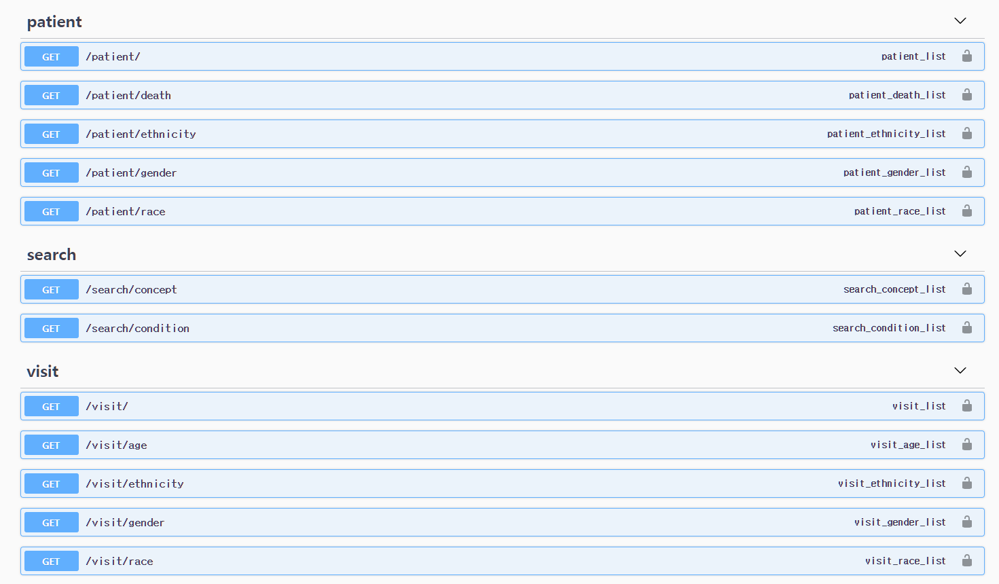

[](https://hits.seeyoufarm.com)     

# 설치방법

1. `git clone`
2. `cd api_test`
3. `python -m venv venv`
4. `pip install -r requirements.txt`
5. manage.py 가 있는 위치에 `.env` 파일 만들기

```
메일로 전달된 내용 
```

6. `python manage.py makemigrations`
7. `python manage.py migrate`
8. `python manage.py runserver`


# Swagger

- `http://127.0.0.1:8000/swagger/` 주소로 들어가면 확인하실 수 있습니다.




# 튜닝 방법

- person

  - gender, race, ethnticity 처럼 concept_id 와 value가 같이 있는 정보를 Concept 테이블을 참조하는 Foreign Field로 바꿔서 중복 자료 제거
  - concept_id 를 통해 join을 수행하기 때문에 concept 테이블의 concept_id 를 index 함

- visit_occurrence

  - person_id, provider_id 를 person 테이블 참조
  - visit_concept_id, visit_type_concept_id 를 Concept 테이블 참조
  - concept_id 를 통해 join을 수행하기 때문에 concept 테이블의 concept_id 를 index 함

- condition_occurrence

  - person_id, provider_id 를 person 테이블 참조
  - condition_concept_id, condition_type_concept_id, condition_status_concept_id, condition_source_concept_id를 Concept 테이블 참조 하고 value 들 지우기

- death

  - person_id를 Foreign Key이자 Primary Key로 설정
  - Concept tabe 참조하게하고 value 지우기


- visit_occurrence, condition_occurrence, drug_exposure, death 처럼 시간 컬럼이 있는 경우
  - 한번에 시간을 넣은 컬럼을 쓰지 말고
  - 년,월,일, 시간 을 각자 다른 컬럼으로 분해하여 검색에 더 용이하도록 변경
    - 만약 시간관련 검색이 많을 경우 년월일 순으로 다중컬럼 인덱싱 추가

